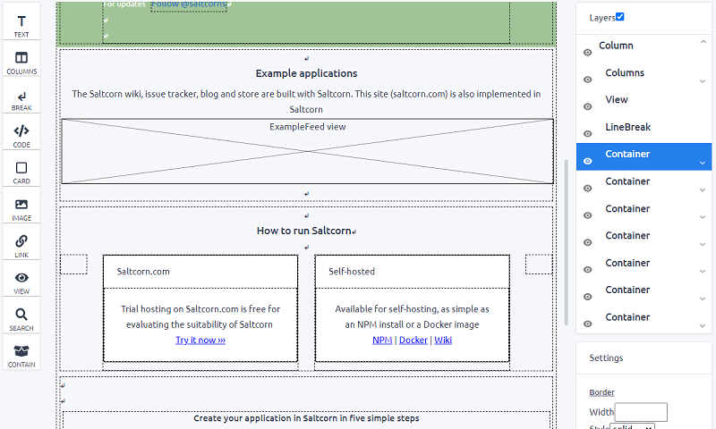

<!--
Ohart ongi: README hau automatikoki sortu da <https://github.com/YunoHost/apps/tree/master/tools/readme_generator>ri esker
EZ editatu eskuz.
-->

# Saltcorn YunoHost-erako

[](https://ci-apps.yunohost.org/ci/apps/saltcorn/)  

[](https://install-app.yunohost.org/?app=saltcorn)

*[Irakurri README hau beste hizkuntzatan.](./ALL_README.md)*

> *Pakete honek Saltcorn YunoHost zerbitzari batean azkar eta zailtasunik gabe instalatzea ahalbidetzen dizu.*  
> *YunoHost ez baduzu, kontsultatu [gida](https://yunohost.org/install) nola instalatu ikasteko.*

## Aurreikuspena

Saltcorn is an extensible open source no-code database application builder. Use it to build web and mobile database applications with flexible views, datatypes, layouts and actions

This repository contains the core codebase, including the code necessary to self-host an instance and to host a multitenant instance.


**Paketatutako bertsioa:** 1.0.0.rc.3~ynh1

## Pantaila-argazkiak



## Dokumentazioa eta baliabideak

- Aplikazioaren webgune ofiziala: <https://saltcorn.com/>
- Erabiltzaileen dokumentazio ofiziala: <https://wiki.saltcorn.com/view/ShowPage/quick-start-guide>
- Administratzaileen dokumentazio ofiziala: <https://wiki.saltcorn.com/view/ShowPage/install-on-ubuntu>
- Jatorrizko aplikazioaren kode-gordailua: <https://github.com/saltcorn/saltcorn>
- YunoHost Denda: <https://apps.yunohost.org/app/saltcorn>
- Eman errore baten berri: <https://github.com/YunoHost-Apps/saltcorn_ynh/issues>

## Garatzaileentzako informazioa

Bidali `pull request`a [`testing` abarrera](https://github.com/YunoHost-Apps/saltcorn_ynh/tree/testing).

`testing` abarra probatzeko, ondorengoa egin:

```bash
sudo yunohost app install https://github.com/YunoHost-Apps/saltcorn_ynh/tree/testing --debug
edo
sudo yunohost app upgrade saltcorn -u https://github.com/YunoHost-Apps/saltcorn_ynh/tree/testing --debug
```

**Informazio gehiago aplikazioaren paketatzeari buruz:** <https://yunohost.org/packaging_apps>
