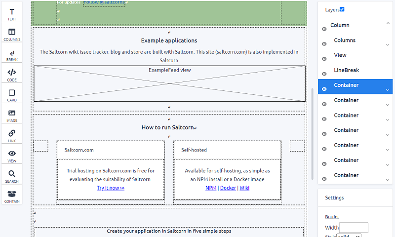

<!--
Nota bene : ce README est automatiquement généré par <https://github.com/YunoHost/apps/tree/master/tools/readme_generator>
Il NE doit PAS être modifié à la main.
-->

# Saltcorn pour YunoHost

[](https://ci-apps.yunohost.org/ci/apps/saltcorn/)  

[](https://install-app.yunohost.org/?app=saltcorn)

*[Lire le README dans d'autres langues.](./ALL_README.md)*

> *Ce package vous permet d’installer Saltcorn rapidement et simplement sur un serveur YunoHost.*  
> *Si vous n’avez pas YunoHost, consultez [ce guide](https://yunohost.org/install) pour savoir comment l’installer et en profiter.*

## Vue d’ensemble

Saltcorn est un générateur d'applications de base de données open source extensible sans code. Utilisez-le pour construire des applications de base de données web et mobiles avec des vues, des types de données, des mises en page et des actions flexibles.

Ce référentiel contient la base de code principale, y compris le code nécessaire pour héberger une instance en propre et pour héberger une instance multi-locataire.


**Version incluse :** 1.0.0.rc.3~ynh1

## Captures d’écran



## Documentations et ressources

- Site officiel de l’app : <https://saltcorn.com/>
- Documentation officielle utilisateur : <https://wiki.saltcorn.com/view/ShowPage/quick-start-guide>
- Documentation officielle de l’admin : <https://wiki.saltcorn.com/view/ShowPage/install-on-ubuntu>
- Dépôt de code officiel de l’app : <https://github.com/saltcorn/saltcorn>
- YunoHost Store : <https://apps.yunohost.org/app/saltcorn>
- Signaler un bug : <https://github.com/YunoHost-Apps/saltcorn_ynh/issues>

## Informations pour les développeurs

Merci de faire vos pull request sur la [branche `testing`](https://github.com/YunoHost-Apps/saltcorn_ynh/tree/testing).

Pour essayer la branche `testing`, procédez comme suit :

```bash
sudo yunohost app install https://github.com/YunoHost-Apps/saltcorn_ynh/tree/testing --debug
ou
sudo yunohost app upgrade saltcorn -u https://github.com/YunoHost-Apps/saltcorn_ynh/tree/testing --debug
```

**Plus d’infos sur le packaging d’applications :** <https://yunohost.org/packaging_apps>
